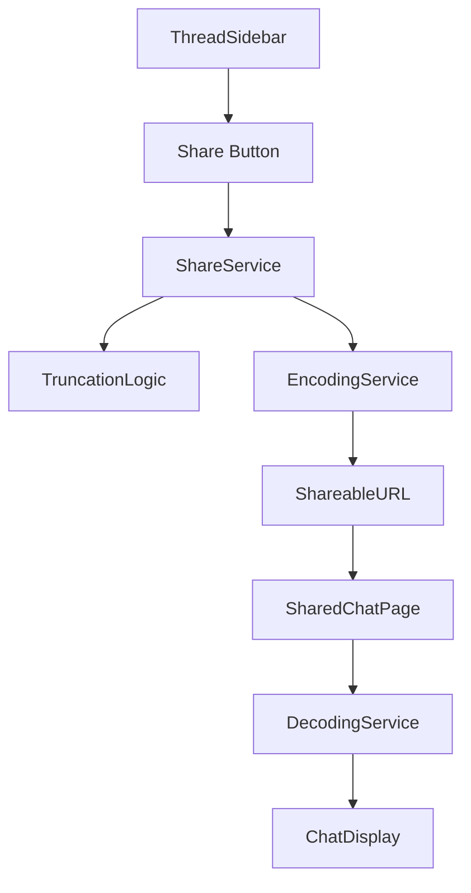

# Design Document

## Overview

The chat sharing feature enables users to share AI conversations through URL-encoded links that work without backend infrastructure. The solution uses smart truncation to handle conversations of any length while maintaining visual fidelity and user experience. The design integrates seamlessly with the existing Open-Fiesta architecture, leveraging the current chat data structures and UI components.

## Architecture

### High-Level Architecture



### Data Flow

1. **Share Initiation**: User clicks share button in ThreadSidebar
2. **Data Processing**: ShareService processes the chat thread using truncation logic
3. **Encoding**: Processed data is encoded to Base64 for URL embedding
4. **URL Generation**: Shareable URL is created and copied to clipboard
5. **Share Consumption**: Recipient opens URL, triggering decode and display process
6. **Display**: Shared chat renders in dedicated read-only view

### Integration Points

- **ThreadSidebar Component**: Add share button alongside existing delete button
- **Next.js Routing**: New route `/shared/[encodedData]` for viewing shared chats
- **Local Storage**: No changes needed - sharing works with existing chat data
- **Toast System**: Leverage existing react-toastify for user feedback

## Components and Interfaces

### Core Components

#### 1. ShareButton Component
```typescript
interface ShareButtonProps {
  thread: ChatThread;
  onShare: (thread: ChatThread) => void;
  className?: string;
}
```

**Responsibilities:**
- Render share icon with consistent styling
- Handle click events and loading states
- Provide accessibility attributes and tooltips

#### 2. ShareService
```typescript
interface ShareService {
  generateShareableUrl(thread: ChatThread): Promise<string>;
  processThreadForSharing(thread: ChatThread): SharedChatData;
}

interface SharedChatData {
  title: string;
  createdAt: number;
  messages: ChatMessage[];
  truncated: boolean;
  originalMessageCount?: number;
  projectContext?: string;
}
```

**Responsibilities:**
- Apply truncation logic to chat threads
- Sanitize data for sharing (remove sensitive information)
- Generate Base64-encoded URLs
- Handle clipboard operations with fallbacks

#### 3. SharedChatPage Component
```typescript
interface SharedChatPageProps {
  encodedData: string;
}
```

**Responsibilities:**
- Decode URL parameters back to chat data
- Render shared chat in read-only format
- Display truncation notices when applicable
- Provide navigation back to main application

#### 4. ChatRenderer Component (Reusable)
```typescript
interface ChatRendererProps {
  messages: ChatMessage[];
  title: string;
  createdAt: number;
  readOnly?: boolean;
  truncated?: boolean;
  originalMessageCount?: number;
}
```

**Responsibilities:**
- Render chat messages with consistent formatting
- Support both interactive and read-only modes
- Display metadata (title, creation date, truncation info)
- Maintain visual consistency with main application

### Data Structures

#### SharedChatData Interface
```typescript
interface SharedChatData {
  version: number; // For future compatibility
  title: string;
  createdAt: number;
  messages: ChatMessage[]; // Last 20 messages
  truncated: boolean;
  originalMessageCount?: number;
  projectContext?: {
    name: string;
    // Exclude systemPrompt for privacy
  };
}
```

#### URL Structure
```
https://app.com/shared/[BASE64_ENCODED_DATA]
```

Where BASE64_ENCODED_DATA contains JSON-stringified SharedChatData.

## Data Models

### Message Truncation Logic

```typescript
interface TruncationConfig {
  maxMessages: number; // 20
  preserveOrder: boolean; // true
  includeMetadata: boolean; // true
}

function truncateMessages(
  messages: ChatMessage[], 
  config: TruncationConfig
): {
  messages: ChatMessage[];
  truncated: boolean;
  originalCount: number;
} {
  const originalCount = messages.length;
  const truncated = originalCount > config.maxMessages;
  
  const selectedMessages = truncated 
    ? messages.slice(-config.maxMessages)
    : messages;
    
  return {
    messages: selectedMessages,
    truncated,
    originalCount
  };
}
```

### Data Sanitization

```typescript
function sanitizeForSharing(thread: ChatThread): SharedChatData {
  // Remove sensitive data
  const sanitizedMessages = thread.messages.map(msg => ({
    role: msg.role,
    content: msg.content,
    modelId: msg.modelId,
    ts: msg.ts,
    // Exclude: code, provider, usedKeyType
  }));
  
  return {
    version: 1,
    title: thread.title,
    createdAt: thread.createdAt,
    messages: sanitizedMessages,
    truncated: false, // Will be set by truncation logic
    projectContext: thread.projectId ? {
      name: getProjectName(thread.projectId)
      // Exclude systemPrompt for privacy
    } : undefined
  };
}
```

### URL Encoding/Decoding

```typescript
function encodeShareData(data: SharedChatData): string {
  const jsonString = JSON.stringify(data);
  return btoa(encodeURIComponent(jsonString));
}

function decodeShareData(encoded: string): SharedChatData | null {
  try {
    const jsonString = decodeURIComponent(atob(encoded));
    return JSON.parse(jsonString);
  } catch {
    return null;
  }
}
```

## Error Handling

### Client-Side Error Scenarios

1. **Clipboard Access Failure**
   - Fallback to manual copy with text selection
   - Display instructions for manual copying
   - Show appropriate error message

2. **URL Encoding Failure**
   - Validate data size before encoding
   - Show error if conversation too large
   - Suggest reducing conversation length

3. **Malformed Share URLs**
   - Graceful error page for invalid URLs
   - Clear error message explaining the issue
   - Provide link back to main application

4. **Decoding Failures**
   - Handle corrupted or invalid encoded data
   - Display user-friendly error messages
   - Offer to redirect to main application

### Error Recovery Strategies

```typescript
interface ErrorHandlingStrategy {
  clipboardFallback: () => void;
  urlValidation: (data: SharedChatData) => boolean;
  gracefulDegradation: (error: Error) => void;
}
```

## Testing Strategy

### Unit Testing

1. **ShareService Tests**
   - Truncation logic with various message counts
   - Data sanitization removes sensitive information
   - URL encoding/decoding round-trip accuracy
   - Error handling for edge cases

2. **Component Tests**
   - ShareButton renders correctly and handles clicks
   - SharedChatPage displays data accurately
   - ChatRenderer works in both modes (interactive/read-only)
   - Error states display appropriate messages

### Integration Testing

1. **End-to-End Sharing Flow**
   - Complete sharing process from button click to URL generation
   - Shared URL opens correctly in new browser session
   - Visual consistency between original and shared views
   - Truncation notices appear when expected

2. **Cross-Browser Compatibility**
   - Clipboard API support across browsers
   - URL length limits in different browsers
   - Base64 encoding/decoding consistency
   - Fallback mechanisms work correctly

### Performance Testing

1. **Large Conversation Handling**
   - Performance with maximum message count (20)
   - URL generation time for complex conversations
   - Memory usage during encoding/decoding
   - Browser responsiveness during operations

2. **URL Size Validation**
   - Ensure URLs stay within browser limits (~2000 chars)
   - Test with various message content types
   - Validate encoding efficiency
   - Monitor URL length growth patterns

## Security Considerations

### Data Privacy

1. **Sensitive Information Exclusion**
   - API keys never included in shared data
   - User account information excluded
   - Provider-specific metadata removed
   - System prompts excluded from project context

2. **Public Access Model**
   - Shared links are publicly accessible
   - No authentication required for viewing
   - No tracking of link access
   - Links remain valid indefinitely

### URL Security

1. **Data Validation**
   - Validate decoded data structure
   - Sanitize content before rendering
   - Prevent XSS through proper escaping
   - Handle malformed data gracefully

2. **Content Safety**
   - No executable content in shared data
   - Read-only display prevents modifications
   - No external resource loading from shared content
   - Safe rendering of user-generated content

## Performance Optimization

### Encoding Efficiency

1. **Data Compression**
   - Minimize JSON structure size
   - Remove unnecessary whitespace
   - Use efficient field names
   - Consider future compression algorithms

2. **URL Length Management**
   - Monitor encoded data size
   - Implement size warnings for users
   - Optimize data structure for compactness
   - Plan for future chunking if needed

### Rendering Performance

1. **Shared View Optimization**
   - Lazy load non-critical components
   - Optimize message rendering for read-only mode
   - Minimize JavaScript bundle size
   - Use efficient CSS for styling

2. **Memory Management**
   - Clean up object URLs after use
   - Minimize memory footprint of shared data
   - Efficient component unmounting
   - Prevent memory leaks in long-running sessions

## Future Enhancements

### Phase 2 Improvements

1. **Advanced Truncation**
   - Intelligent message selection (not just last N)
   - Conversation summarization for context
   - User-configurable truncation settings
   - Preview of what will be shared

2. **Enhanced Sharing Options**
   - Multiple sharing formats (JSON, markdown)
   - Selective message sharing
   - Conversation highlights/bookmarks
   - Social media integration

### Phase 3 Features

1. **Analytics and Management**
   - Share analytics dashboard
   - Link expiration options
   - Access control mechanisms
   - Share history tracking

2. **Collaboration Features**
   - Comment system for shared chats
   - Collaborative editing capabilities
   - Team sharing workspaces
   - Integration with external platforms

## Implementation Considerations

### Development Approach

1. **Incremental Implementation**
   - Start with basic sharing functionality
   - Add error handling and edge cases
   - Implement UI polish and feedback
   - Add advanced features iteratively

2. **Code Organization**
   - Separate concerns into focused modules
   - Reuse existing components where possible
   - Maintain consistency with current patterns
   - Document public APIs clearly

### Deployment Strategy

1. **Feature Flags**
   - Enable gradual rollout
   - A/B testing capabilities
   - Quick rollback if issues arise
   - User feedback collection

2. **Monitoring**
   - Track sharing success rates
   - Monitor error frequencies
   - Measure user adoption
   - Performance metrics collection