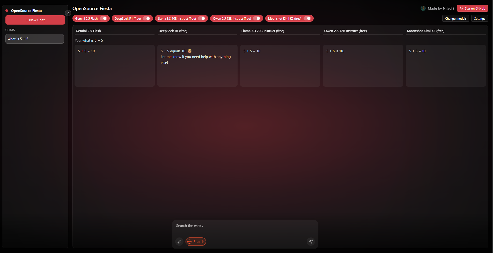

# Open-Fiesta

<video controls poster="./public/osfiesta.png" width="800">
  <source src="./public/OSFiesta.mp4" type="video/mp4" />
  <a href="./public/OSFiesta.mp4">
    
  </a>
  Your browser does not support the video tag.
</video>

<!-- Fallback link for renderers that don't support <video> -->
[](public/OSFiesta.mp4)

An open-source, multi-model AI chat playground built with Next.js App Router. Switch between providers and models, compare outputs side-by-side, and use optional web search and image attachments.

## Features

- **Multiple providers**: Gemini, OpenRouter (DeepSeek R1, Llama 3.3, Qwen, Mistral, Moonshot, Reka, Sarvam, etc.)
- **Selectable model catalog**: choose up to 5 models to run
- **Web search toggle** per message
- **Image attachment** support (Gemini)
- **Clean UI**: keyboard submit, streaming-friendly API normalization

## Tech Stack

- Next.js 14 (App Router, TypeScript)
- Tailwind CSS
- API routes for provider calls
- Docker containerization support

## Quick Start

### Option 1: Traditional Development

1. Install deps

```bash
npm i
```

2. Configure environment
   Copy the example environment file and add your API keys:

```bash
cp .env.example .env
```

   Then edit `.env` with your API keys. **For the default models to work, you need:**

```bash
# REQUIRED: Unstable Provider (GPT-5 Chat, Sonnet 4, Grok 4)
INFERENCE_API_KEY=kf-aP6qQ7rR8sS9tT0uUv1wX2xC3yZ4b  # Already provided

# REQUIRED: Google Gemini (Gemini 2.5 Pro)
GEMINI_API_KEY=your_key_from_https://aistudio.google.com/app/apikey

# REQUIRED: Pollinations (Evil Uncensored)
OPEN_PROVIDER_API_KEY=your_seed_tier_token_from_https://auth.pollinations.ai/
```

   **Optional providers for additional models:**

```bash
# OpenRouter (for additional free models)
OPENROUTER_API_KEY=your_key_from_https://openrouter.ai/keys

# Mistral AI (for Mistral models)
MISTRAL_API_KEY=your_key_from_https://console.mistral.ai
```

3. Run dev server

```bash
npm run dev
# open http://localhost:3000
```

### Option 2: Docker Development

1. Build and run with Docker Compose (recommended for development):

```bash
npm run docker:dev
# or
docker-compose up ai_fiesta_dev
```

2. For production build with Docker:

```bash
npm run docker:build
npm run docker:run
# or
docker-compose up ai_fiesta
```

### Option 3: Manual Docker Commands

```bash
# Build the image
docker build -t ai_fiesta .

# Run the container
docker run -p 3000:3000 -e OPENROUTER_API_KEY=your_key_here ai_fiesta

# Run with environment file
docker run -p 3000:3000 --env-file .env.local ai_fiesta
```

## Environment Variables

- `OPENROUTER_API_KEY`: API key from https://openrouter.ai (required for OpenRouter models)
- `GOOGLE_GENERATIVE_AI_API_KEY`: API key from Google AI Studio (required for Gemini models)

You can also provide an API key at runtime in the UI's Settings panel.

## Docker Support

This project includes comprehensive Docker support for both development and production:

### Development

- Hot reload enabled for instant code changes
- Volume mounting for live code updates
- Includes all development dependencies

### Production

- Multi-stage build for optimized image size (~100MB)
- Proper security practices with non-root user
- Environment variable configuration support

### Available Docker Commands

- `npm run docker:build` - Build production Docker image
- `npm run docker:run` - Run production container
- `npm run docker:dev` - Start development environment with Docker Compose
- `npm run docker:prod` - Start production environment with Docker Compose

## Project Structure

- `app/` – UI and API routes
  - `api/openrouter/route.ts` – normalizes responses across OpenRouter models; strips reasoning, cleans up DeepSeek R1 to plain text
  - `api/gemini/route.ts`, `api/gemini-pro/route.ts`
- `components/` – UI components (chat box, model selector, etc.)
- `lib/` – model catalog and client helpers
- `Dockerfile` – Production container definition
- `Dockerfile.dev` – Development container definition
- `docker-compose.yml` – Multi-container setup
- `.dockerignore` – Files to exclude from Docker builds

## Notes on DeepSeek R1

Open-Fiesta post-processes DeepSeek R1 outputs to remove reasoning tags and convert Markdown to plain text for readability while preserving content.

## Contributing

We welcome contributions of all kinds: bug fixes, features, docs, and examples.

- **Set up**

  - Fork this repo and clone your fork.
  - Start the dev server with `npm run dev`.

- **Branching**

  - Create a feature branch from `main`: `feat/<short-name>` or `fix/<short-name>`.

- **Coding standards**

  - TypeScript, Next.js App Router.
  - Run linters and build locally:
    - `npm run lint`
    - `npm run build`
  - Keep changes focused and small. Prefer clear names and minimal dependencies.

- **UI/UX**

  - Reuse components in `components/` where possible.
  - Keep props typed and avoid unnecessary state.

- **APIs & models**

  - OpenRouter logic lives in `app/api/openrouter/`.
  - Gemini logic lives in `app/api/gemini/` and `app/api/gemini-pro/`.
  - If adding models/providers, update `lib/models.ts` or `lib/customModels.ts` and ensure the UI reflects new options.

- **Docker changes**

  - When modifying dependencies, ensure both `Dockerfile` and `Dockerfile.dev` are updated if needed
  - Test both development and production Docker builds

- **Commit & PR**

  - Write descriptive commits (imperative mood): `fix: …`, `feat: …`, `docs: …`.
  - Open a PR to `main` with:
    - What/why, screenshots if UI changes, and testing notes.
    - Checklist confirming `npm run lint` and `npm run build` pass.
    - Test both traditional and Docker setups if applicable.
  - Link related issues if any.

- **Issue reporting**

Thank you for helping improve Open‑Fiesta!

## License

This project is licensed under the MIT License. See `LICENSE` for details.

## Acknowledgements

- Model access via OpenRouter and Google
